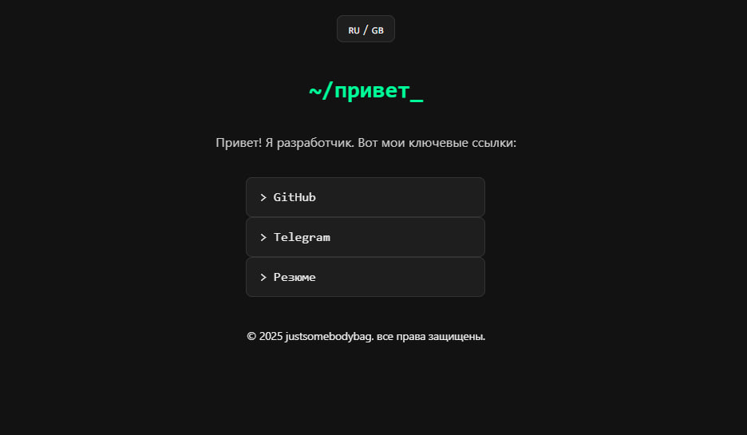

# My Minimalist Dark Portfolio

A fast, secure, and minimal static site with a dark theme, deployed on GitHub Pages.

## Preview



## Live Demo

https://justsomebodybag.github.io

## Features

- Dark mode with system preference support
- Responsive design with Flexbox
- Minimal JavaScript for theme toggle
- Content Security Policy (CSP) implemented
- SEO optimized with sitemap and robots.txt

## How to Run Locally

1. Clone the repo:

```bash
git clone https://github.com/username/username.github.io.git
cd username.github.io
Open index.html in your browser or use a simple HTTP server, e.g.:
```
```bash
python3 -m http.server 8000
Visit http://localhost:8000
```
How to Deploy
Push your changes to the main branch of the repository — GitHub Pages will update automatically.

Contact
GitHub: JustSomeBodyBag

